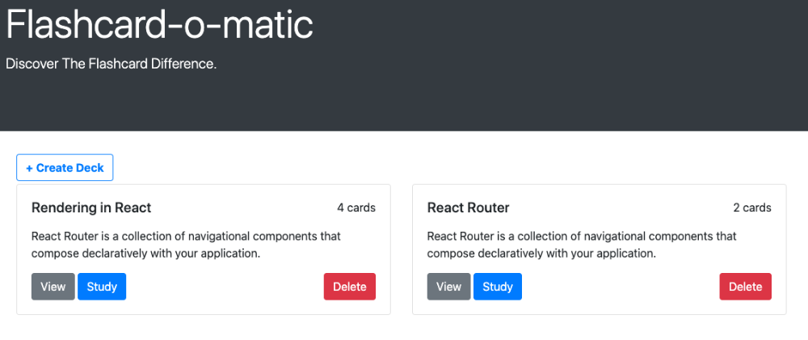
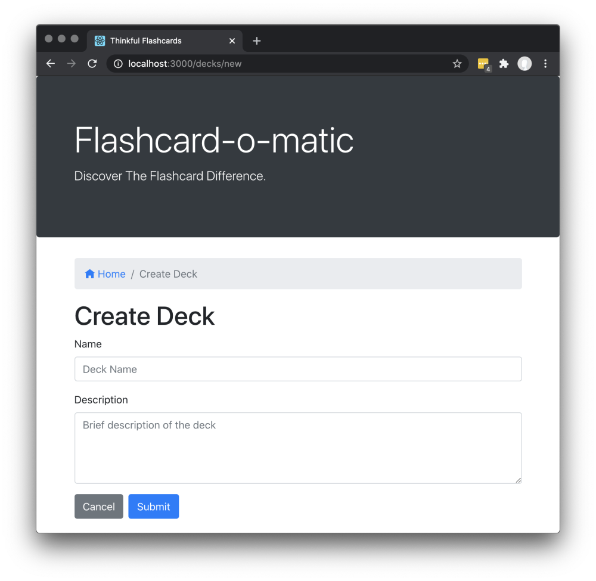
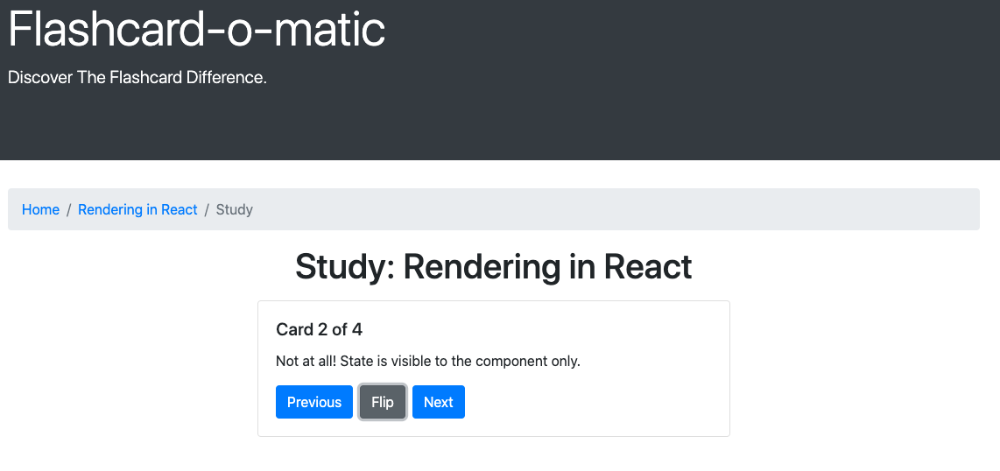

# Flashcard-o-matic
 
 This project is designed to work with rendering and state management using React.
 This flash card app allows for the creation, modification and use of text flashcards to aide in study.
 
 
## Project description:
 
     Teachers will use this application to create decks of flash cards for the subjects that they teach,
     and students will study the decks.
       
## Technologies used:
 
 	• Built using Bootstrap and React to design and manage the user-interface, respectively
    • Implemented React Hooks and React Router to manage API calls for data and component routing, respectively
	
## Screens:

   ### Home
	 
	• Create Deck: input a deck name and brief description; users will then be directed to the deck page
 	• View: directs users to the deck page where they can get an overview of deck contents
	• Study: directs users to an interactive study session with the deck's flashcards
	• Delete: users also have the option to delete the deck and all of its contents
	

	
  ### Deck
	
	• Edit: users are able to edit the deck name and description
	• Study: enter study mode
	• Add Cards: add individual cards to a selected deck
	• Delete: Delete deck
	

  ### Card
	
	• Edit: Edit card front and back
	• Delete: Delete card
	

	
  ### Study
	
	• Flip: view the back of the card
	• Next: view the next card
	• Previous: view the previous card
	
  
	
	
 
